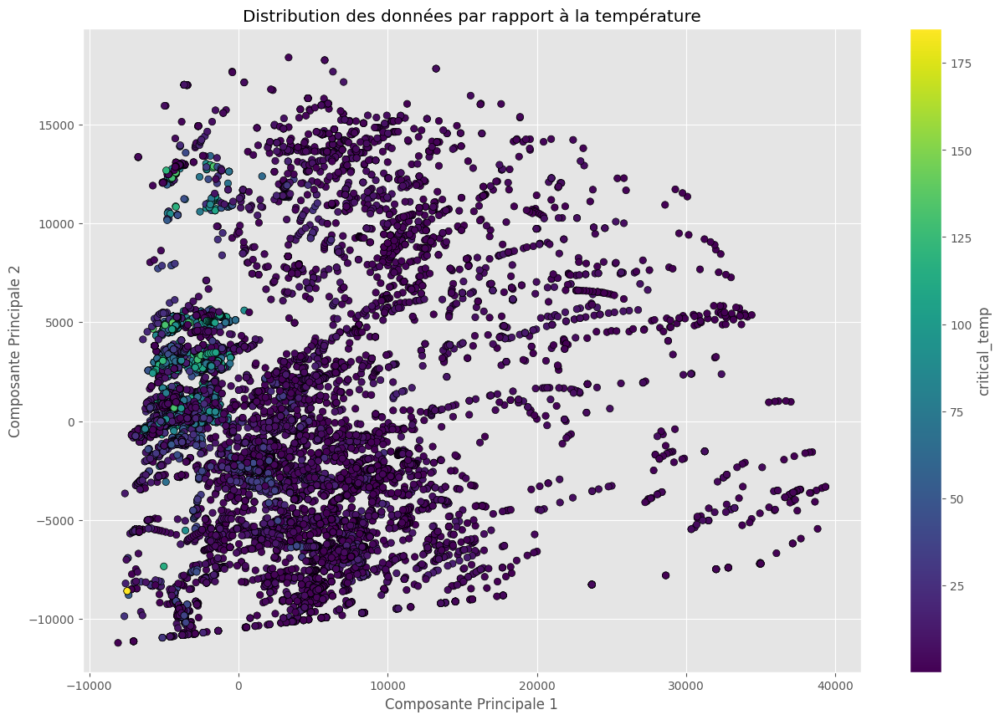
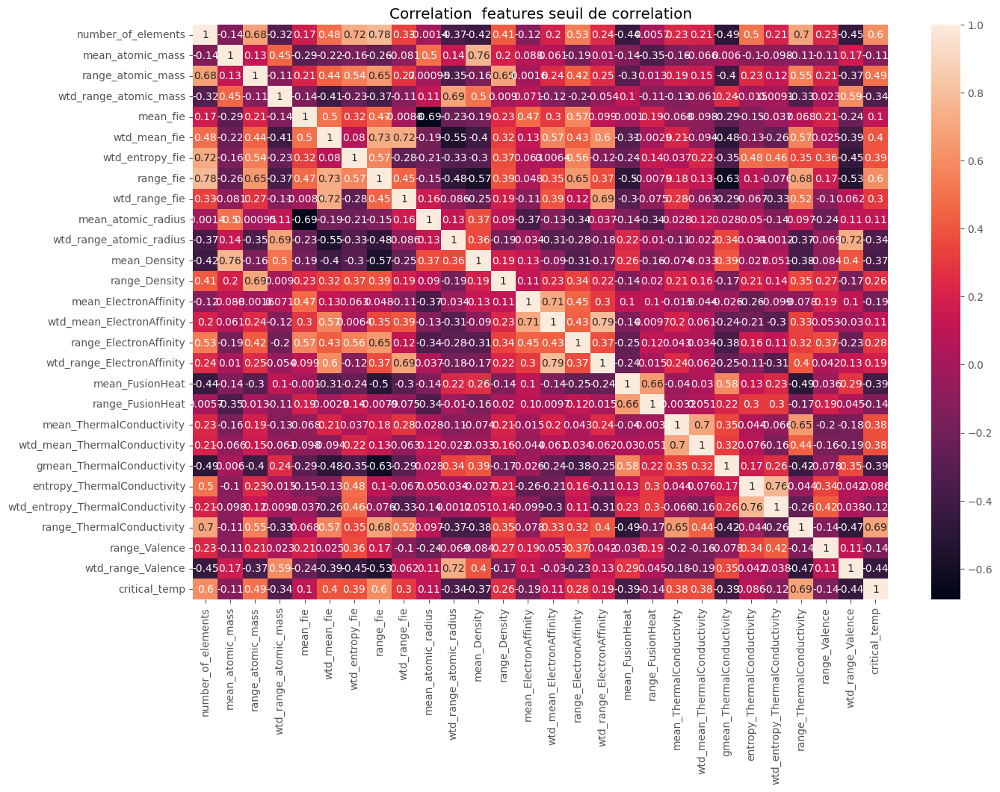
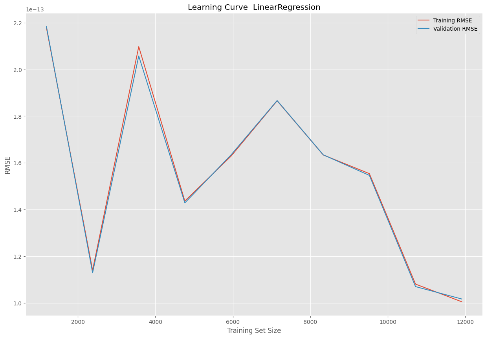

# Prédiction de la température critique de supraconducteurs

Prédire la température en dessous de laquelle un matériau devient supraconducteur, à partir de ses propriétés physico-chimiques. Le jeu de données décrit plus de 21 000 matériaux par 81 caractéristiques dérivées de leur composition : masse atomique, rayon, densité, conductivité thermique, affinité électronique, valence — chacune résumée par sa moyenne, sa moyenne pondérée, son écart-type et ses extrêmes.

## Les données

| Fichier | Contenu |
| --- | --- |
| `data/data.csv` | Les 81 caractéristiques dérivées et la température critique |
| `data/unique_m.csv` | La composition élémentaire brute de chaque matériau |
| `rapport_projet_ia_i40.pdf` | Le rapport complet de l'étude |

## Démarche

Exploration des distributions, étude des corrélations entre caractéristiques, puis comparaison de plusieurs régresseurs avec courbes d'apprentissage à l'appui.





## Un résultat qui demande vérification



La courbe d'apprentissage de la régression linéaire affiche une **RMSE de l'ordre de 10⁻¹³**, avec les courbes d'entraînement et de validation parfaitement superposées.

Ce n'est pas un bon résultat, c'est un signal d'alarme. Aucun modèle ne prédit une grandeur physique à la précision machine. Un tel score signifie qu'une variable explicative **encode la cible** : soit `critical_temp` s'est retrouvée parmi les variables d'entrée lors d'une fusion des deux fichiers, soit une caractéristique en est une fonction déterministe.

Tant que ce point n'est pas tranché, les performances rapportées pour ce modèle ne veulent rien dire. C'est la première chose à reprendre : vérifier la liste exacte des colonnes passées au modèle, et refaire tourner l'ensemble une fois la fuite écartée.

La littérature sur ce jeu de données situe les bons modèles autour de **9 à 10 K de RMSE** — c'est l'ordre de grandeur à viser.

## Exécution

```bash
pip install pandas numpy scikit-learn matplotlib seaborn
jupyter notebook projet_ia_i4_0.ipynb
```

Les données sont incluses.

## Contenu du dépôt

| Fichier | Rôle |
| --- | --- |
| `projet_ia_i4_0.ipynb` | Exploration, modélisation, courbes d'apprentissage |
| `assets/` | Figures extraites du carnet |
